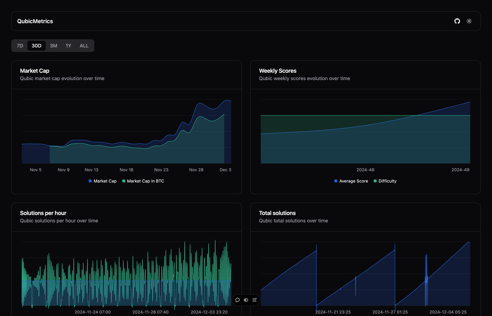

# QubicMetrics



QubicMetrics is a web application that provides historical insights and analytics for the Qubic ecosystem. The platform visualizes key metrics and statistics from the Qubic network.

## Features

- Historical data visualization of key Qubic metrics
- Open source contribution statistics
- Interactive dashboards and charts
- Real-time data updates

## Tech Stack

- React 18 with TypeScript
- Vite for build tooling and development
- Tailwind CSS for styling
- Shadcn/ui for UI components
- Jotai for state management

## Getting Started

### Prerequisites

- Node.js (v20 or higher recommended)
- A Qubic Metrics API token. Get one [here](https://api.qubicmetrics.com)

### Environment Setup

1. Clone the repository
2. Copy the environment variables template:
   ```bash
   cp .env.example .env
   ```
3. Edit `.env` and add your Qubic Metrics API token

### Installation

1. Install dependencies:
   ```bash
   npm install
   ```

2. Start the development server:
   ```bash
   npm run dev
   ```

The application will be available at `http://localhost:5173`

## Contributing

Contributions are welcome! Please feel free to submit a Pull Request.

## License

MIT.
